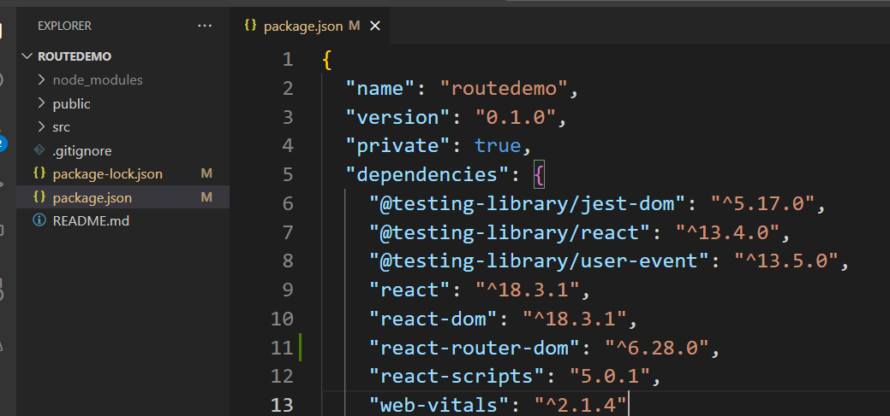

# Routing 

`npx create-react-app routedemo`

`cd routedemo`

To implement routing we need to install `react-router-dom`

npm install react-router.dom

to verify the package installed or not 
goto &rarr; package.json


create components folder in src

add below components (files)

Header.jsx
Home.jsx
About.jsx
Contact.jsx
Products.jsx

# Header.jsx
```js
import React from "react";
import { Link } from "react-router-dom";
import "./Header.css";
function Header() {
  return (
    <header>
      <nav>
        <ul>
          <li>
            <Link to="/">Home</Link>
          </li>
          <li>
            <Link to="/about">About</Link>
          </li>
          <li>
            <Link to="/contact">Contact</Link>
          </li>
          <li>
            <Link to="/products">Products</Link>
          </li>
        </ul>
      </nav>
    </header>
  );
}

export default Header;

```

# Headder.css
```css
header{
    background-color: #333;
    padding: 10px;
}

nav ul{
    list-style-type: none;
    padding: 0;
}

nav ul li{
    display: inline;
    margin-left: 10px;
}

nav ul li a{
    color: white;
    text-decoration: none;
}

nav ul li a:hover{
    text-decoration: underline;
}
```

# Home.jsx
```js
import React from "react";

export default function Home() {
  return (
    <div>
      <h2> Welocme to Our online Store Home Page </h2>
      <p> Find your favourite needs here</p>
    </div>
  );
}

```

# About.jsx

```jsx
import React from "react";
export default function About() {
  return (
    <div>
      <h2> About Us</h2>
      <p>
        {" "}
        ell shoppers the origin story of your business and why you started it.
        For the most impact, make it memorable and personal, so customers relate
        and connect with your brand. If your brand is your name or it was formed
        based on a personal brand, your company’s story can be one and the same
        with your founder story.{" "}
      </p>
    </div>
  );
}

```

# Contact.jsx
```jsx
import React from "react";
export default function Contact() {
  return (
    <div>
      <h2>Contact us </h2>
      <p>
        Some things you can do here Your Orders Your Orders Track packages Edit
        or cancel orders Returns and Refunds Returns and Refunds
      </p>
    </div>
  );
}

```

# ProductList.jsx
```jsx
import React from "react";
import "./ProductList.css";

const products = [
  {
    id: 1,
    name: "Laptop",
    description: "A high-performance laptop",
    isDelivered: true,
  },
  {
    id: 2,
    name: "Phone",
    description: "A smartphone with a large display",
    isDelivered: false,
  },
  {
    id: 3,
    name: "Tablet",
    description: "A tablet with a sleek design",
    isDelivered: true,
  },
  { id: 4, name: "Monitor", description: "A 4K monitor", isDelivered: false },
  {
    id: 5,
    name: "Keyboard",
    description: "A mechanical keyboard",
    isDelivered: true,
  },
];

function ProductList() {
  return (
    <div>
      <h1>Product List</h1>
      <table border="1">
        <thead>
          <tr>
            <th>ID</th>
            <th>Name</th>
            <th>Description</th>
            <th>Delivered</th>
          </tr>
        </thead>
        <tbody>
          {products.map((product) => (
            <tr key={product.id}>
              <td>{product.id}</td>
              <td>{product.name}</td>
              <td>{product.description}</td>
              <td>
                {product.isDelivered ? (
                  <span className="delivered">&#10004;</span>
                ) : (
                  "Pending"
                )}
              </td>
            </tr>
          ))}
        </tbody>
      </table>
    </div>
  );
}

export default ProductList;

```

# ProductList.css
```css
.delivered {
    color: green;
    font-weight: bold;
  }

```

# App.jsx

```js
import logo from "./logo.svg";
import "./App.css";
import Header from "./components/Header";
import Home from "./components/Home";
import About from "./components/About";
import Contact from "./components/Contact";
import ProductList from "./components/Products";
import { BrowserRouter as Router, Route ,Routes} from "react-router-dom";

function App() {
  return (
    <Router>
      <Header />
      <Routes>
        <Route path="/" element={<Home />} />
        <Route path="/about" element={<About />} />
        <Route path="/contact" element={<Contact />} />
        <Route path="/products" element={<ProductList />} />
      </Routes>
    </Router>
  );
}

export default App;

```
 Now run the App npm start


